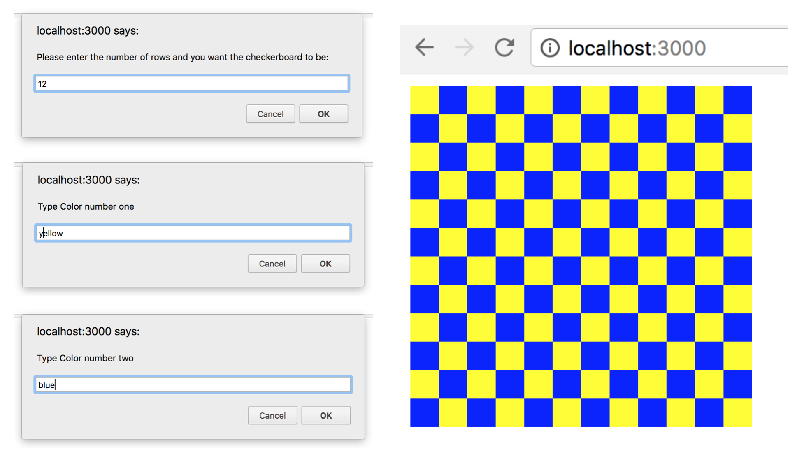

Practice Project to Learn React
---
 
React application that prompts a user for a number of rows, and then render the corresponding checkerboard. For example, a user entering "12" into the prompt would see the following in the browser. For an added challenge, have the user provide the checkerboard colors.


Setup the project by going to the root folder of the application and type following command in the console:
---

```
**npm install**
```

Usage
---
Start the development server with this command in the console:

```
**npm start**
```

Go to http://localhost:3000 in your browser and follow prompts.


Result
---

